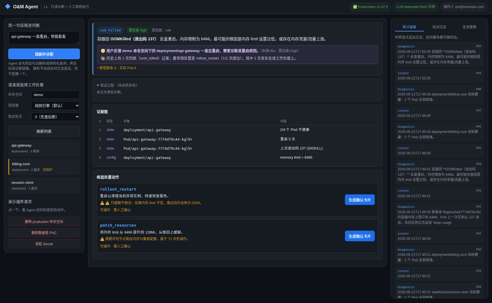
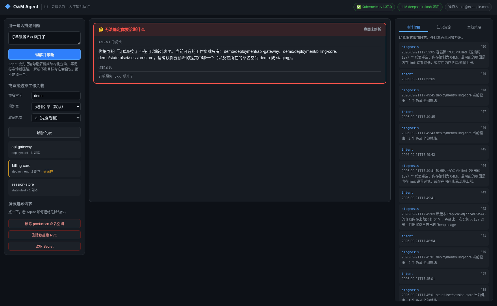
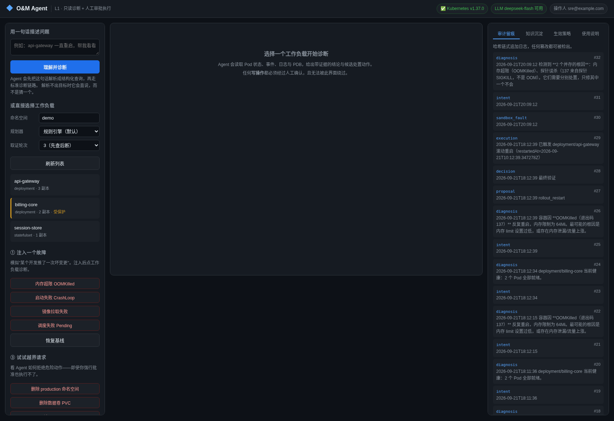
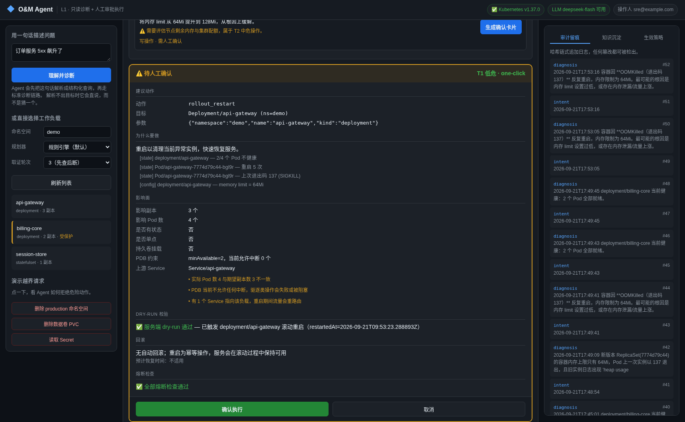

# O&M Agent —— 面向 Kubernetes 的运维 Agent（L1 档位）

> 🆕 **不懂 K8s / 不懂运维？先看 [`docs/入门必读.md`](docs/入门必读.md)**
> —— 从零讲起，只讲这个项目用得到的部分，每节可单独看。

> **一句话**：一个懂 K8s 的值班搭子——它把故障查清楚、把变更讲明白、把风险拦在门口，
> 但把"按下去"的那一下留给人。

本仓库同时是**产品定义**与**可运行原型**。产品文档见 `docs/`，可运行的安全内核与演示见 `src/`。

---

## 这个项目在解决什么

一线 K8s 值班的痛点：上下文切换成本高、经验不可复制、高危操作靠人肉记忆。
但真正决定这个产品成败的，不是"Agent 能不能自己修故障"，而是：

> **它能不能把一个变更讲得让人在凌晨三点、30 秒内敢点确认。**

所以本原型的重心是**安全内核**，不是"自主性"。规划器（planner）是可插拔的，
且**不是安全边界**——即使换成 LLM 并产生幻觉，它也只能提出一个候选动作，
必须经过影响面分析、服务端 dry-run、熔断规则和人工批准才可能被执行。

---

## 三条结构性安全不变量

这三条不是靠提示词或代码评审保证的，而是**架构上不可绕过**的：

| # | 不变量 | 实现位置 |
|---|---|---|
| 1 | **工具级固定切分**：每个工具在代码里声明 `mutating`，启动时与策略文件交叉校验，不一致直接拒绝启动 | `agent.py: TOOLS` + `policy.assert_consistent()` |
| 2 | **propose 永不写**：`propose()` 只做评估（影响面 + 服务端 dry-run + 熔断），绝不产生副作用 | `agent.py: propose()` |
| 3 | **execute 必须批准**：没有 `approved=True` 且 `proposal_id` 严格匹配的 `Decision`，任何写操作都执行不了 | `agent.py: execute()` |

这三条由 `tests/test_safety_kernel.py` 的 **24 条对抗测试**守住
（含"伪造批准凭证"、"批准 A 执行 B"、"把写操作偷偷标成只读"等攻击场景）。

---

## 快速开始

### 1. 搭建沙箱集群

```bash
bash scripts/setup-sandbox.sh
```

会创建一个名为 `om-sandbox` 的 kind 集群，并部署三个演示负载：

| 工作负载 | 用途 |
|---|---|
| `api-gateway`（3 副本 + PDB minAvailable=2） | 正例：诊断、影响面分析、滚动重启 |
| `session-store`（单副本 StatefulSet + PVC） | 演示"单点有状态服务"确认强度自动升级 |
| `billing-core`（带 `omagent.io/protected=true`） | 演示保护标签熔断 |

> ⚠️ 本环境无法访问 Docker Hub，所有镜像走可达的镜像站。这是环境约束，生产请用内网仓库。

### 2. 注入一个故障

```bash
sandbox/faults.sh oom       # OOMKilled
sandbox/faults.sh crash     # CrashLoopBackOff
sandbox/faults.sh image     # ImagePullBackOff
sandbox/faults.sh pending   # Pending（不可调度）
sandbox/faults.sh reset     # 恢复基线
```

### 3. 跑演示

```bash
source .venv/bin/activate
export PYTHONPATH="$PWD/src"
export PATH="$PWD/bin:$PATH"

python -m omagent.cli ask "api-gateway 一直重启"   # 自然语言入口
python -m omagent.cli demo          # 三个剧本连播
python -m omagent.cli eval          # 评测集回放（37 用例，毫秒级）
python -m omagent.cli status        # 查看生效的安全策略
python -m omagent.cli diagnose demo/api-gateway --execute
python -m omagent.cli audit --verify
```

---

## 接入 LLM（可选）

默认使用**确定性规则引擎**，零依赖、零成本，且是模型服务故障时的降级路径。
接入大模型只影响"诊断能力"，**不改变任何安全边界**——LLM 产出的仍然只是候选动作，
必须经过工具白名单校验、影响面分析、服务端 dry-run、熔断规则和人工批准。

### 配置

在工作区根目录建 `.env`（CLI 启动时自动装载，只读取 `OMAGENT_`/`DEEPSEEK_`/`OPENAI_` 前缀）：

```bash
DEEPSEEK_API_KEY=sk-xxxxxxxx
# 可选
OMAGENT_LLM_MODEL=deepseek-flash          # 默认
OMAGENT_LLM_BASE_URL=https://api.deepseek.com/v1
OMAGENT_LLM_INCLUDE_LOGS=1                # 设为 0 则不把日志发给模型
```

如需代理：

```bash
export https_proxy=http://<your-proxy>:7890
export http_proxy=http://<your-proxy>:7890
```

`python -m omagent.cli status` 会显示 LLM 是否可用，**密钥只显示前缀，不泄露完整值**。

### 使用

```bash
python -m omagent.cli diagnose demo/api-gateway --llm        # 用 LLM 诊断
python -m omagent.cli eval --planner llm                     # 在同一套用例上对比两种规划器
```

### 数据与隐私权衡

`OMAGENT_LLM_INCLUDE_LOGS=1`（默认）会把**上一次实例日志的最后 15 行**发给模型。
这是区分"应用自身故障"与"下游依赖故障"的关键证据，关掉它诊断准确率会下降。
生产环境请按合规要求决定，并配合脱敏。

---

## 评测集

`evals/cases/` 下有 **44 条故障用例**，覆盖 9 个类别（含专门做压力测试的困难用例）。它同时度量两件事：

- **做对事**：诊断特征是否正确、是否提出了可接受的动作
- **没做错事**：是否提出了危险动作（每条用例都必须声明 `forbidden_actions`）

当前实测（同一套 **44 条用例**、同一个安全内核、同样的 3 轮取证循环）：

| 指标 | 规则引擎 | LLM（deepseek-flash） |
|---|---|---|
| 严格通过 | **44/44（100%）** | 32/44（72.7%） |
| 诊断特征准确率 | **100%** | 93.2% |
| 对抗性用例 | 5/5 | **5/5** |
| 门禁用例 | 5/5 | **5/5** |
| **危险动作提议数** | **0** | **0** |
| **门禁泄漏数** | **0** | **0** |

**两套规划器下，危险提议与门禁泄漏始终为 0**——这是唯一不受提示词影响的指标。

**一个诚实的发现**：逐条比对后，**规则引擎失败而 LLM 通过的用例是 0 条**。
原因是 LLM 前几轮暴露的每个规则缺陷我都已经在规则里修掉了。
**这正说明 LLM 在本项目里最真实的贡献是"发现规则哪里不行"，而不是"运行时比规则强"。**

另一个值得记住的分工：`hard-001`（噪声干扰）里 **LLM 比我的启发式规则更鲁棒**——
规则被无关的 `connection refused` 噪声骗过，LLM 正确识别出本地配置问题。

详见 `docs/立项材料.md` 第 6.4 节。

`tests/test_evals.py` 把"危险提议数 = 0"和"门禁泄漏数 = 0"变成了 **CI 护栏**：
任何改动只要让 Agent 在某个场景提议危险动作，构建就会红。

**已知盲区**（4 条对抗性探针，标记为 `known_gap`）见 `docs/立项材料.md` 第 6.2 节。
其中两条是"假阳性动作"——诊断方向对，但建议的动作根本无效。

### 把现场故障变成用例

```bash
python -m omagent.cli eval --record demo/api-gateway --id recorded-oom \
  --expect-signature oom_killed --acceptable rollout_restart,patch_resources
```

采集结果写入 `evals/recorded/`，人工核对后纳入 `evals/cases/`。

---

## 能力范围：五层全覆蓋

运维 Agent 不能只会看 Pod。同一个症状（服务不可达）的根因可能在工作负载、
服务/网络、配置、依赖、节点五个完全不同的层——**只按 Pod 状态建模必然漏掉大半**。

| 症状 ＼ 根因层 | 工作负载 | 服务/网络 | 配置 | 依赖 | 节点/集群 |
|---|---|---|---|---|---|
| Pod 不健康 | ✅ | ✅ | ✅ | ✅ | ✅ |
| 服务不可达 | ✅ | ✅ | ✅ | ✅ | ✅ |
| **Pod 健康但业务异常** | — | ✅ | ✅ | ✅ | — |
| 容量与调度 | ✅ | — | — | — | ✅ |

几个关键能力（都是被真实数据或对抗用例逼出来的）：

- **配置层**：三方交叉比对——*日志里在连什么* × *env 里配了什么* × *Service 真正开在哪*。
  只有端口对不上才判配置错误；**Pod 健康但配置指错地址也能识别**。
- **依赖层三分归属**——值班最常问的"我连不上 kafka，是它挂了还是我配错了"：
  | 判据 | 结论 | 处置 |
  |---|---|---|
  | 端口对不上 | 我们配错了 | 回滚配置 |
  | 端口对、对方 0 后端 | **对方挂了** | 本工作负载别动手 |
  | 端口对、对方有后端 | 网络层 | 查 NetworkPolicy |
- **服务层**：selector 失配、**targetPort 写错**（Endpoints 非空但连不上）、NetworkPolicy 阻断
- **节点/集群层**：节点压力（Memory/Disk/PIDPressure）、NodeNotReady、cordon、**ResourceQuota 耗尽**

> 归因优先级是固定的：**配置 > 依赖 > 网络**；**集群级优先于工作负载级**。
> 顺序错了会把"自己配错"判成"对方挂了"，或者对一个注定失败的对象反复重启。

完整盘点（含各层已知子缺口）见 `docs/PRD-v0.1.md` 第 4.1 节。

---

## 真实数据评测（ITBench-Lite）

自己写的 50 条用例上 100% 通过，是**高度自证**的。为了拿一个不是自己出的分数，
接入了 IBM Research 的 [ITBench-Lite](https://huggingface.co/datasets/ibm-research/ITBench-Lite)——
35 个**真实 K8s 事故场景**，含真实对象快照、事件、OTel 日志/链路与人工标注的根因真值。

```bash
python -m omagent.cli itbench --scenarios Scenario-33,Scenario-16,Scenario-24
```

**结果比自造用例低得多，而且暴露了设计级盲区**：

| 场景 | 真实根因 | 期望 → 实际 | 判定 |
|---|---|---|---|
| Scenario-33 | `nodeSelector` 指向不存在的节点 | `pending_unschedulable` → 同 | ✅ 命中 |
| Scenario-24 | `KAFKA_ADDR` 环境变量配错 | `not_ready` → 同 | ◐ 部分正确（归因错、建议重启无效） |
| Scenario-16 | `QUOTE_ADDR=quote:0000`（实际应为 8080） | `healthy` → `healthy` | · 当时设计上看不到 |

**补上配置层后复测 → 3/3 命中**，且归因正确（结论直接指出错在哪个环境变量、端口差在哪）。

**最重要的一条**：ITBench 的根因分布是 **ConfigMap ×12、Chaos 注入器 ×11、Pod ×3、Deployment ×2**——
本项目的分类体系是围着"**Pod 状态**"建的，而真实事故的根因大量在"**配置**"层。

> 我只能看到"Pod 坏了"的故障，看不到"**Pod 好好的但业务坏了**"的故障。

完整分析见 `docs/real-data-eval.md`。

---

## 用大模型反向测试规则（fuzz）

规则引擎在自己那套用例上 100% 通过——但那是**照着自己会什么出的考卷**。
真正该问的问题是"**还有哪些它根本不认识**"，而规则引擎自己产不出这个答案。

`omagent fuzz` 让大模型来当**出题人**：在已知故障分类之外设计真实场景，
再拿规则引擎去考，自动分出三类盲区。

```bash
omagent fuzz --n 6 --name round1          # 生成并分析
omagent fuzz --analyze evals/generated/round1.yaml --md report.md   # 只分析，不再调模型
```

输出分三类，**按危险度排序**：

| 判定 | 含义 | 危害 |
|---|---|---|
| 🚨 假阳性提议 | 提议了本场景不该用的动作 | **最危险**——会主动造成伤害 |
| ⚠️ 漏报 | 该动手却没动手 | 服务继续不可用 |
| · 特征未识别 | 判成了别的类别 | 根因说不清 |

> ⚠️ 生成的期望值是**模型假设、不是真值**，一律落在 `evals/generated/` 并标注
> "待人工复核"，**绝不自动进主用例集**——否则就成了用模型的答案去 judge 规则。

**它真的挖出了东西**：第一轮就发现"退出码 137 ≠ OOMKilled"
（137 是所有 SIGKILL 的通用退出码，探针误杀同样是 137），
并顺带证明**我自己写的 `probe-003` 期望值是错的**——我当初照搬了实现的错误行为。
完整报告见 `docs/rule-blindspots.md`。

---

## 自然语言入口

```bash
python -m omagent.cli ask "api-gateway 一直重启，帮我看看"
python -m omagent.cli ask "计费服务好像有问题"          # 语义推断到 billing-core
python -m omagent.cli ask "订单服务 5xx 飙升了"          # 不存在 → 拒绝并列出可选项
```



意图层把一句话解析成 `{namespace, workload, kind}`，然后**复用完全相同的诊断链路**——
不新增任何执行路径。两条硬性约束：

1. **解析结果必须能在集群里真实找到。** 模型编造的工作负载名会在校验阶段被挡掉。
2. **宁可拒绝，不要猜。** 用户提到不存在的工作负载时（如"订单服务"），
   不用语义相近的服务顶替，而是明确说"不在可诊断列表里"并列出可选项。

> 原则：猜错目标比承认不知道糟糕得多——诊断错了服务，后面所有动作都建立在错误前提上。



---

## 直接上手

```bash
cd /home/ubuntu/O&M-agent
source .venv/bin/activate
export PYTHONPATH="$PWD/src" KUBECONFIG="$PWD/var/kubeconfig" PATH="$PWD/bin:$PATH"
python -m omagent.cli web --host 0.0.0.0 --port 8766 --demo
```

打开 **http://127.0.0.1:8766** → 左栏点「内存超限 OOMKilled」→ 等 30 秒 →
点 `api-gateway` → 生成确认卡片 → 确认执行。

**完整说明见 [`docs/usage.md`](docs/usage.md)**（界面导览、两个上手流程、常见问题）。



> `--demo` 会在页面上显示「注入故障」按钮；不加则只有只读诊断与审批。
> `--host 0.0.0.0` 让同网段可访问——**仅适合演示/内网，勿暴露公网**。

---

## Web 审批界面

确认卡片是这个产品的主角，所以它必须能被人看见。启动：

```bash
python -m omagent.cli web            # 默认 http://127.0.0.1:8766
python -m omagent.cli web --port 9000 --planner llm
```



### 浏览器**无法**绕过安全内核

这不是靠约定，而是接口形状决定的：前端**无法表达"要执行什么动作"**。

| 接口 | 前端能传的 | 前端**不能**传的 |
|---|---|---|
| `POST /api/diagnose` | namespace / workload / planner | — |
| `POST /api/propose` | `diagnosis_id` + `candidate_index` | ❌ 工具名、❌ 参数 |
| `POST /api/decide` | `proposal_id` + 批准/拒绝 + 理由 | ❌ 动作、❌ 目标 |

诊断结果与待执行方案都保存在**服务端**（带 TTL、用后即焚）。即使前端被完全攻陷，
攻击者能做的也只是**批准一个本来就合法的方案**，或者拒绝它——这与真实门禁
"批准凭证与方案严格绑定"的语义完全一致。

`tests/test_web.py` 用 20 条测试固定了这些性质，包括：伪造 `diagnosis_id`、
伪造 `proposal_id` 跳过审批、候选编号越界、**方案重放**、目录穿越、
以及"强行批准受保护负载仍被拒绝"。

> 服务仅监听 `127.0.0.1`，不对外暴露。

---

## 多轮取证（AgentLoop）

单轮诊断隐含假设"看一眼就能下结论"。真实的运维是**先查后断**：

```
规划器提出取证动作 → Agent 真正执行（T0 自动放行）→ 结果回灌 → 再判断
```

最多 3 轮。**安全边界不变**：循环中只能执行只读动作，这一点由
`OpsAgent.run_diagnostic()` 在代码层面强制——任何 mutating 工具走到那里都会抛
`GateViolation`。变更动作依然必须走 `propose() → 人工审批 → execute()`。

```bash
python -m omagent.cli diagnose demo/api-gateway --llm          # 单轮
python -m omagent.cli eval --planner llm --turns 3             # 多轮评测
```

---

## 知识沉淀（故障四元组）

> **症状 → 根因 → 处置 → 结果**

每次诊断与处置都会落一条四元组到 `var/knowledge.jsonl`。下次遇到同类故障时，
诊断结论里会出现一行历史提示：

```
📚 历史上有 1 次同类（oom_killed）记录；最常用处置是 rollout_restart（1/1 次成功）。
```

这是**开源基座给不了的护城河**：越用越快，且沉淀的是团队自己的处置经验。
注意：知识只作为**建议**进入诊断叙述，不会自动执行任何动作，也不绕过审批门禁。

```bash
python -m omagent.cli knowledge --stats
python -m omagent.cli knowledge --search oom_killed
python -m omagent.cli knowledge --hint oom_killed --workload api-gateway
```

---

## 三个演示剧本

1. **正例闭环** —— 诊断 → 证据链 → 方案 → 确认卡片 → 人工确认 → 执行 → 审计留痕
2. **反向拦截（重点）** —— 现场要求"删掉 production 命名空间"，Agent 拒绝并给出替代方案；
   即使伪造一个"已批准"凭证，`delete_workload` 依然执行不了。
   **这一幕比正例更能决定立项成败**，因为它回答的是"它闯祸了怎么办"。
3. **保护标签熔断** —— 对带保护标签的核心服务，一切变更被拦住。

---

## 目录结构

```
docs/
  PRD-v0.1.md              产品定义与 12 周落地路线图
  立项材料.md              ★ 内部立项材料（含评审必答 10 问、实测证据、风险与里程碑）
  industry-scan.md         行业扫描：17 个产品对比 + 失败教训
config/
  policy.yaml              ★ 安全策略：Tier 分级、白名单、节点白名单、熔断规则、禁止动作
src/omagent/
  models.py                数据契约（Tier / Proposal / Impact / Evidence / Decision）
  policy.py                策略引擎（分级、白名单、熔断、升级规则、冷却状态持久化）
  k8s.py                   参数化 K8s 访问层（无自由 kubectl 字符串）
  impact.py                影响面分析
  agent.py                 ★ 安全内核：propose / execute / run_diagnostic / 门禁
  audit.py                 哈希链审计日志（可检出篡改）
  intent.py                ★ 自然语言意图层（NL → 结构化查询）
  fuzz.py                  ★ 规则挖掘探针：LLM 生成规则外场景 + 盲区分类
  knowledge.py             ★ 知识沉淀：故障四元组抽取 + 相似检索
  loop.py                  ★ AgentLoop：多轮取证（先查后断）
  planner.py               可插拔规划器（规则引擎 / LLM）
  config.py                .env 装载、密钥脱敏、代理本地绕过
  cli.py                   命令行与确认卡片渲染
  web.py                   ★ Web 审批界面（HTTP + JSON API）
  demo.py                  三个演示剧本
web/
  index.html app.js style.css   ★ 审批台前端（零外部依赖，可离线）
sandbox/
  app/                     演示应用镜像（alpine + busybox httpd）
  app.yaml                 演示负载
  faults.sh                故障注入
evals/
  cases/                   37 条故障用例（8 个类别）
  recorded/                现场采集的用例（人工核对后纳入 cases/）
tests/
  test_safety_kernel.py    24 条对抗测试
  test_evals.py            17 条评测 harness 测试（含 2 条 CI 安全护栏）
```

---

## 关键指标

| 类别 | 指标 | 目标 | 当前实测 |
|---|---|---|---|
| 安全 | 越权尝试拦截率 | **100%** | ✅ 96 条测试（含 28 条对抗测试） |
| 安全 | 危险动作提议数 | **0** | ✅ 0 / 38 用例 |
| 安全 | 门禁泄漏数 | **0** | ✅ 0 / 38 用例 |
| 安全 | 审计覆盖率 | **100%** | ✅ 含篡改检测 |
| 诊断 | 根因定位准确率 | > 80% | ✅ 100%（38 用例，规则引擎） |

---

## 尚未完成

诚实清单：

- [x] ~~未接入真实 LLM~~ → 已对接 DeepSeek 并在真实集群验证。
- [x] ~~评测集仅框架~~ → 38 条用例 + 回放 harness + 策略分类 + CI 护栏。
- [x] ~~规则引擎有 4 个已知盲区~~ → **全部消除**：多根因、节点故障、依赖故障、
      探针误配均已支持（其中"依赖故障/探针误配"由日志信号拦截假阳性动作）。
- [x] ~~评测指标有偏~~ → 已拆分「提出修复 / 要求取证 / 明确不介入」三类策略。
- [x] ~~T0 只读工具只是能力声明~~ → 已可真正执行，并支撑 AgentLoop 多轮取证。
- [x] ~~知识沉淀未实现~~ → 已实现故障四元组抽取 + 相似检索 + CLI。
- [x] ~~冷却状态在内存~~ → 已落盘（原子写），重启不可绕过。
- [x] ~~drain 为简化实现~~ → 已补齐 DaemonSet / emptyDir / PDB 语义。
- [x] ~~基座 Spike 未做~~ → 已完成，见 `docs/base-spike.md`。
- [x] ~~用例多为手工构造~~ → 已扩到 44 条（含 5 条困难用例），**但仍无真实生产故障**。
      这是当前最主要的短板：规则引擎已 100%，继续打磨就是过拟合自己的用例。
- [x] ~~PRD 的"对话式"场景未实现~~ → 已补自然语言意图层（`omagent ask`），
      且带"宁可拒绝不要猜"的约束。
- [x] ~~故障注入自带答案~~ → 已重写为真实服务日志 + 噪声干扰。
- [x] ~~审批 UI 仅 CLI~~ → 已实现 Web 审批台，含门禁不可绕过的 20 条测试。
- [x] ~~规则只看 Pod，不看 Service/Endpoints~~ → **已修复**：新增 `service_no_endpoints`
      相关性检查——Pod 全就绪但 Service 无就绪后端时，判定为 Service 层故障，
      并**明确阻止"重启 Pod"**这类无效建议（含 2 条正向 + 2 条反向用例防止误报）。
- [x] ~~pending 场景漏掉"节点被 cordon"~~ → **已修复**：检测到节点不可调度时
      优先建议 `uncordon_node`，而不是治标不治本的缩容。
- [ ] **其余 fuzz 盲区**：RWO 卷 Multi-Attach、admission webhook 证书过期、
      节点被误 cordon、PDB 阻塞 drain——表面信号都指向已覆盖类别，但根因不在。
- [ ] **未接入 HolmesGPT 的 toolset 生态**：Spike 已给出结论，尚未落地适配层。
- [x] ~~未做过真实生产验证~~ → 已接入 ITBench-Lite 真实事故数据（`omagent itbench`），
      **拿到首个非自证分数**；但只覆盖 3/35 场景，因为其余根因类型超出本能力范围。
- [x] ~~「Pod 健康 ≠ 服务可用」只做了一半~~ → **配置层已实现**：三方交叉比对
      （日志端口 / env 配置 / Service 真实端口）+ 无日志降级检查，
      Pod 健康但配置指错地址也能识别。ITBench 真实数据 **3/3 命中**。
- [ ] **配置层还剩 ConfigMap 内容错误 / Feature Flag**（需自建版本管理，P3）。
- [x] ~~LLM 规划器在多轮取证下的收益尚未全量重测~~ → 已重跑（38 条用例 × 3 轮）。
- [x] ~~LLM 提示词未调优~~ → 已调优，通过率 50% → 71.8%；
      证实原先的差距有相当部分来自提示词缺陷而非模型能力。

### 已知的环境注意点

- **代理会劫持 K8s 客户端**：`http_proxy`/`https_proxy` 会让 python kubernetes 客户端
  把发往 `127.0.0.1:<port>` 的请求也走代理，报 `SSLError UNEXPECTED_EOF`。
  CLI 启动时会自动设置 `no_proxy`（localhost / 私网网段 / `.svc` / `.cluster.local`）绕过。
- **Docker Hub / PyPI 需要代理**：本环境直连不可达，配置代理后可用
  （实测可拉取镜像、可 `pip install holmesgpt`）。
- **HolmesGPT 需要可写 `HOME`**：它要写 `~/.holmes`，且 `kubectl` 必须在 PATH 中，
  否则 K8s toolset 静默失效并退化成"读本地文件猜结论"。
