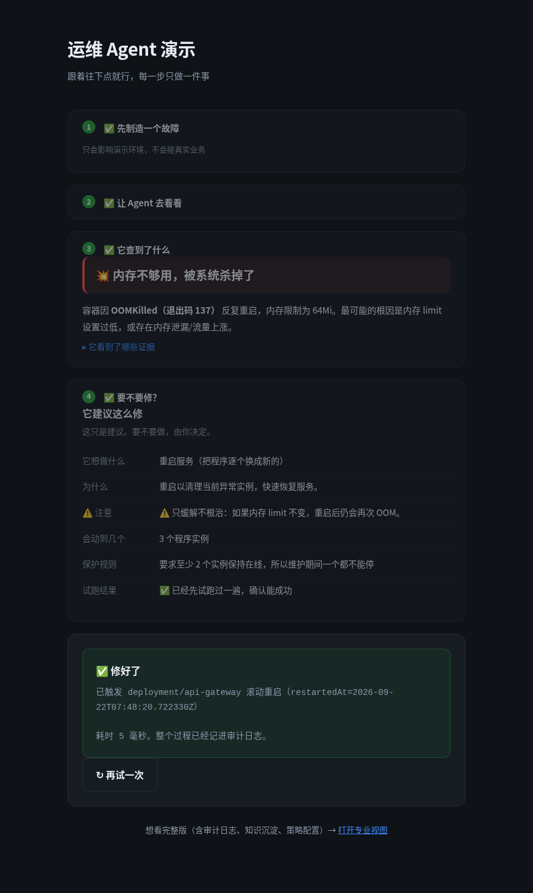

# 使用手册

> 面向：想上手试一下的人 ｜ 预计 5 分钟

---

## 一、打开页面

| | 地址 |
|---|---|
| 本机 | **http://127.0.0.1:8766** |
| 同网段其他机器 | **http://172.22.232.148:8766** |

> ⚠️ 当前为了让你能直接访问，服务监听在 `0.0.0.0`（所有网卡）。
> 这**仅适合演示/内网**——它带写操作能力，**不要暴露到公网**。
> 只想本机访问的话，用 `omagent web --port 8766`（默认只绑 127.0.0.1）。

如果页面打不开，见文末「打不开怎么办」。

---

## 二、两个页面，选一个

| 页面 | 地址 | 适合谁 |
|---|---|---|
| **简化演示页**（默认） | **http://127.0.0.1:8766** | **第一次接触，跟着点就行** |
| 专业运维台 | http://127.0.0.1:8766/pro | 想看审计日志、知识沉淀、策略配置 |

**简化页只有一条主线**：制造故障 → 诊断 → 看结论 → 决定修不修 → 完成。
一次只显示一件事，走完的步骤会自动收起成一行。
术语全部翻译成了人话（比如 `CrashLoopBackOff` 显示为"程序起来就崩，一直在重启"）。

### 简化页长什么样



---

## 三、界面导览（专业视图）

```
┌────────────┬──────────────────────────┬──────────────┐
│            │                          │ 审计留痕      │
│  左栏      │        中间：主舞台       │ 知识沉淀      │
│            │                          │ 生效策略      │
│ ①自然语言   │  诊断结论 + 证据链        │ 使用说明      │
│ ②工作负载   │  + 候选动作              │              │
│ ③注入故障   │  + 确认卡片 ← 主角        │              │
│ ④越界请求   │                          │              │
└────────────┴──────────────────────────┴──────────────┘
```

---

## 四、两个上手流程

### 流程 A：走一遍完整闭环（约 2 分钟）

1. **左栏「① 注入一个故障」→ 点「内存超限 OOMKilled」**
   模拟某个开发推了一次坏变更。等 **30 秒左右**让它显现。
2. **点左栏工作负载 `api-gateway`**
   Agent 自动取证：Pod 状态、事件、日志、PDB。
3. **看中间的诊断结论**——会指出签名（如 `oom_killed`）、置信度、证据链。
4. **点候选动作右侧的「生成确认卡片」**
   **这是整个产品的主体**，卡片上会看到：
   - 动作 / 目标 / 参数
   - **为什么要做**（挂了证据链）
   - **影响面**（副本数、是否有状态、PDB 允不允许中断）
   - **dry-run 校验**（服务端干跑结果）
   - **回滚路径与预计恢复时间**
   - **熔断检查**
5. **点「确认执行」** → 填变更理由 → 执行
6. **右栏「审计留痕」**里能看到刚才每一步：intent → diagnosis → proposal → decision → execution
7. **右栏「知识沉淀」**里会多一条「症状→根因→处置→结果」
8. **左栏「恢复基线」**复原，然后再诊断一次 —— 会看到 `📚 历史上有 N 次同类记录` 的提示

### 流程 B：看它怎么拒绝（约 1 分钟）——**这一段最能说明问题**

1. **点左栏「③ 试试越界请求」→「删除 production 命名空间」**
   看它拒绝，并给出替代建议。
2. **点工作负载 `billing-core`**（黄色左边框 = 受保护）→ 诊断 → 生成确认卡片
   方案会被「保护标签」熔断拦下，**「确认执行」按钮是灰的**。
3. 想验证"强行批准也没用"，可以在浏览器控制台执行：
   ```js
   App.diagnose({namespace:'demo', name:'billing-core', kind:'deployment'})
   ```
   即使拿到 proposal_id 强行批准，安全内核也会返回 `refused`。

---

## 五、左栏三个入口

| 入口 | 用途 |
|---|---|
| **用一句话描述问题** | 自然语言，如 `api-gateway 一直重启`、`计费服务好像有问题`。<br>解析不出目标时它会**直说**并列出可选项，而不是猜一个。 |
| **或直接选择工作负载** | 点名字即诊断。可切换规划器（规则引擎 / LLM）与取证轮次（1 / 3 轮）。 |
| **① 注入一个故障** | 5 个按钮，见上。**仅在 `--demo` 模式显示**。 |

---

## 六、右栏四个页签

| 页签 | 看什么 |
|---|---|
| **审计留痕** | 哈希链日志。每条含前一条的哈希，**篡改或删除都能检出**。 |
| **知识沉淀** | 历次处置的四元组（症状→根因→处置→结果）与累计统计。 |
| **生效策略** | 当前 Tier 白名单、命名空间/节点白名单、爆炸半径、冷却期、T3 禁止动作。 |
| **使用说明** | 页面内的简版说明。 |

---

## 七、命令行等价（不想开浏览器时）

```bash
cd /home/ubuntu/O&M-agent
source .venv/bin/activate
export PYTHONPATH="$PWD/src"
export PATH="$PWD/bin:$PATH"
export KUBECONFIG="$PWD/var/kubeconfig"

# 自然语言
python -m omagent.cli ask "api-gateway 一直重启"

# 直接指定
python -m omagent.cli diagnose demo/api-gateway --execute --pick 1

# 注入故障 / 恢复
bash sandbox/faults.sh oom
bash sandbox/faults.sh reset

# 跑评测（68 条用例）
python -m omagent.cli eval

# 用真实事故数据评测
python -m omagent.cli itbench --scenarios Scenario-33,Scenario-16,Scenario-24

# 校验审计链
python -m omagent.cli audit --verify
```

---

## 八、常见问题

### 页面打不开
```bash
# 1. 服务还在吗
curl -s http://127.0.0.1:8766/api/health      # 期望 {"ok":true}

# 2. 不在就重启
cd /home/ubuntu/O&M-agent && source .venv/bin/activate
export PYTHONPATH="$PWD/src" KUBECONFIG="$PWD/var/kubeconfig" PATH="$PWD/bin:$PATH"
python -m omagent.cli web --host 0.0.0.0 --port 8766 --demo
```
如果你是从自己电脑通过 SSH 看 DSH 页面，需要把端口也转发过来：
```bash
ssh -L 3080:127.0.0.1:3080 -L 8766:127.0.0.1:8766 <你的跳板机>
```

### 注入了故障但诊断说"健康"
故障需要几十秒才显现（Pod 重建 + 探针失败 + 重启计数上去）。等 **30-60 秒**再诊断。
也可以在左栏点「刷新列表」确认 Pod 状态。

### 「确认执行」是灰的
说明该方案被熔断规则拦下了——看卡片最下方的「熔断检查」，会写清是哪条规则
（保护标签 / 命名空间白名单 / 爆炸半径 / 变更冷却 / 冻结窗口）。

### 变更冷却是什么
同一工作负载 **5 分钟内不允许重复变更**（防止抖动式连续重启）。刚执行完再点会提示冷却中。

### 点了「确认执行」没反应？
已在最新版修复。原因是三个叠加的问题，如果你看到的是旧版本，刷新页面（Ctrl+Shift+R）即可：
1. **结果出现在卡片上方、视野之外** → 现在改成**整张卡片替换为结果**并自动滚动到位
2. **浏览器拦截原生弹窗**（Chrome 那个"阻止此页面创建更多对话框"复选框一旦勾上，
   `confirm()` 永远返回 false）→ 现在改为**页内模态框**，不依赖原生弹窗
3. **按钮是灰的但没说为什么** → 现在拦截原因以**红色横幅**显示在卡片**最顶部**，
   按钮也直接写着被哪条规则拦下（如「⛔ 变更冷却」）

### 注入了故障但「恢复基线」没效果？
已在最新版修复。原因：故障是用 `kubectl patch` 注入的，而 `apply` **只会移除自己记录过的字段**——
`patch` 改的字段不在 last-applied 注解里，所以 `apply` 清不掉，`nodeSelector` 会一直留着。
现在 reset 会**先用显式 patch 清字段，再 apply 基线**。

### 点了「修复」显示成功，但问题还在？
已在最新版修复。这条反馈挖出了**三个叠加的问题**：

| # | 问题 | 修复 |
|---|---|---|
| 1 | **首选动作是"缓解"而非"根治"** —— OOM 场景把 `rollout_restart` 排在第一位，而它自己的说明就写着"只缓解不根治：内存 limit 不变，重启后仍会 OOM" | 根治动作（`patch_resources`）排到首选；界面上对"仅缓解"的动作**显式标黄警告** |
| 2 | **沙箱故障的数值没设计好** —— 程序要吃 90MB，而上限从 64Mi 翻倍只到 128Mi，**连根治动作都不够** | 实测出 bash 的瞬时峰值约为目标值的 **1.9 倍**，据此把负载调到 50MB（峰值约 96MB），正好落在 64Mi 与 128Mi 之间 |
| 3 | **演示程序在内存够的时候也不提供服务** —— OOM 模式分配完内存就 `sleep 3600`，**从不启动服务** → 就绪探针永远失败 → 修好了也显示不可用 | 改为分配成功后正常提供服务 |

**换句话说：不是你看不懂，是当时那套演示确实修不好。**

### 一直被"熔断"（变更冷却）
演示模式下冷却期已从 300 秒缩短到 **20 秒**（生产仍用 300 秒防抖动）。
也可以手动指定：`omagent web --demo --cooldown 5`。

### LLM 规划器选不了
需要 `.env` 里有 `DEEPSEEK_API_KEY`，且当前网络能访问 `api.deepseek.com`。
不可用时会自动降级到规则引擎，功能不受影响。

---

## 九、这个页面**不**做什么

- ❌ 不接受自由形式的 kubectl 命令——前端只能表达"批准/拒绝"，**动作由服务端持有**，
  即使前端被完全控制也无法注入任意动作
- ❌ 不碰 Secret、不删工作负载/命名空间/PVC、不改 RBAC
- ❌ 不自动执行任何写操作——全部需要人点确认
- ❌ 不做无人值守修复

能力范围与已知子缺口见 `docs/PRD-v0.1.md` 第 4.1 节。
